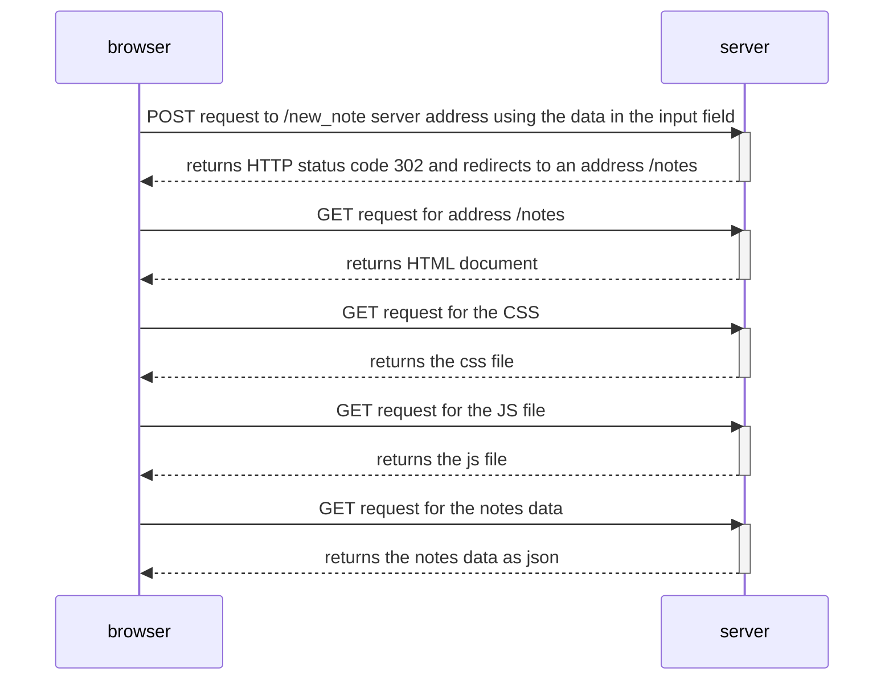

```mermaid
sequenceDiagram
    participant browser
    participant server

    browser->>server: POST request to /new_note server address using the data in the input field
    activate server
    server-->>browser: returns HTTP status code 302 and redirects to an address /notes
    deactivate server

    browser->>server: GET request for address /notes
    activate server
    server-->>browser: returns HTML document
    deactivate server

    browser->>server: GET request for the CSS
    activate server
    server-->>browser: returns the css file
    deactivate server

    browser->>server: GET request for the JS file
    activate server
    server-->>browser: returns the js file
    deactivate server

    browser->>server: GET request for the notes data
    activate server
    server-->>browser: returns the notes data as json
    deactivate server

```