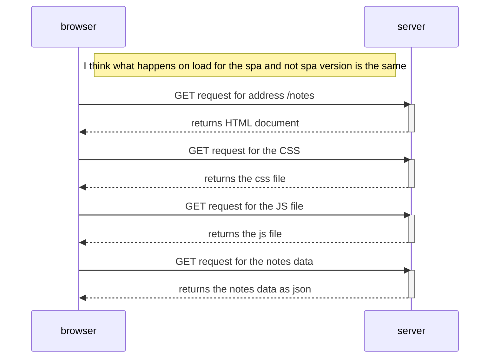

```mermaid
sequenceDiagram
    participant browser
    participant server

    note right of browser: I think what happens on load for the spa and not spa version is the same

    browser->>server: GET request for address /notes
    activate server
    server-->>browser: returns HTML document
    deactivate server

    browser->>server: GET request for the CSS
    activate server
    server-->>browser: returns the css file
    deactivate server

    browser->>server: GET request for the JS file
    activate server
    server-->>browser: returns the js file
    deactivate server

    browser->>server: GET request for the notes data
    activate server
    server-->>browser: returns the notes data as json
    deactivate server

```