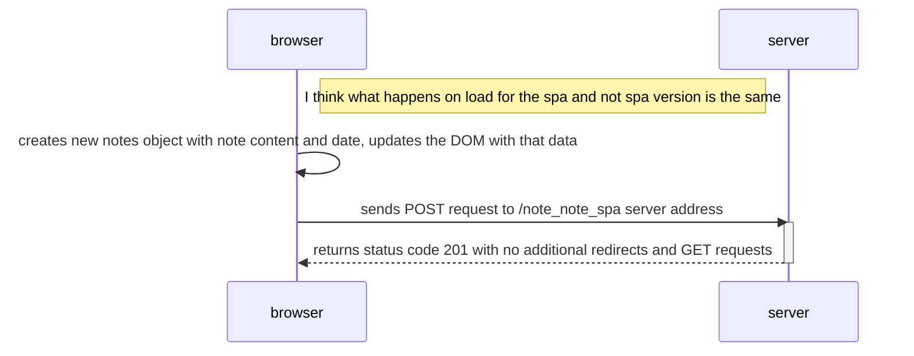

```mermaid
sequenceDiagram
    participant browser
    participant server

    note right of browser: I think what happens on load for the spa and not spa version is the same

    browser->>browser: creates new notes object with note content and date, updates the DOM with that data
    browser->>server: sends POST request to /note_note_spa server address
    activate server
    server-->>browser: returns status code 201 with no additional redirects and GET requests
    deactivate server

```